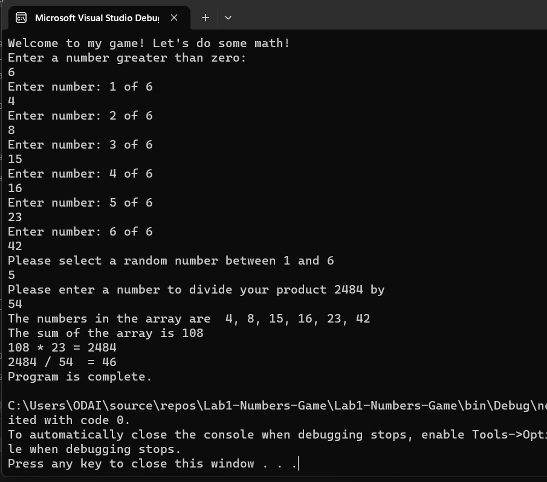

# Lab1-Numbers-Game

## Introduction

In this document, i will explain to you most of the aspects of the simple program that performs mathematical calculations

## What is the purpose of the program?

In this program, the main purpose was to create a simple calculator using C#, which would ask the user to enter a number greater than 0. It then creates an array of integers with the size of the number entered by the user. The program then fills the array with numbers entered by the user. The program then calculates the sum of all the numbers in the array, and then calculates the product of all the numbers in the array. It then calculates the quotient of the product divided by the sum. Finally, it outputs all of these values to the console using other words.

## How do I run the program?

1-first you should enter a number greater than zero. This will be your array size.

2- after that you shoud enter your array elements one by one, and when you reach the end, be shour the sum of all this number in not liss that 20.

3- here the program asks you to select a random number in the range of your array length, and it will start from 1 this number is the rank of the values in your array. It then Multiply the sum of the product with sum.

4- In the final step the program asks you to enter a number to divide your product by, then shows you all the results. 

## What does the program look like? (visual)

The program is a simple screen in which the program asks you to implement certain entries, all with numbers, through a line of instructions. You enter the required information below this line, and the results appear at the bottom directly after you enter all the requirements.

   

